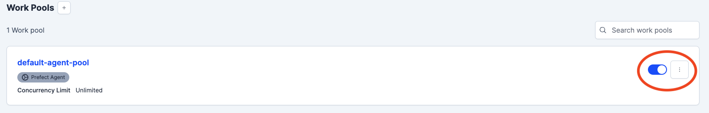

# Model Orchestration and Tracking

Before we can track the runs with MLFlow and schedule them a desired using Prefect, we first need to follow some few steps.

### 1. Start MLFlow
1. Start the MLflow tracking server and UI in this folder using the following command in the Terminal. Only allows tracking of metrics. 

    ```bash
    mlflow ui --backend-store-uri sqlite:///mlflow.db --default-artifact-root artifacts
    ```

2. Alternatively, if you want to store everything, including metrics, artifacts and models in individual files, run the following:

    ```bash
    mlflow ui --backend-store-uri mlruns --default-artifact-root artifacts
    ```

    `mlruns` and `artifacts` refers to the folders where the metrics, models and artifacts will be stored. 

### 2. Start Prefect 

1. To access all the scheduled runs etc, via the Prefect UI, in this folder, run in a new Terminal window:

    ```bash
    prefect orion start
    ```

2. To start an agent that listens for scheduled runs and run them according to their schema, run in another Terminal window:

    ```bash
    prefect agent start --pool default-agent-pool --work-queue credit_risk_model-dev
    ```

    Where the `default-agent-pool` is the name of the agent and the `credit_risk_model-dev` refers to the `work_queue_name` specified in the `main.py` file. 


### 3. Run `main.py` to add runs to the Prefect Queue

Run `main.py` from a fourth Terminal window from this folder:

```bash
python main.py
```

<br><br>

### Remember to

Finally, make sure that the Work Pool is **toggled on** so the agent actually picks up the scheduled jobs from the queue. 




