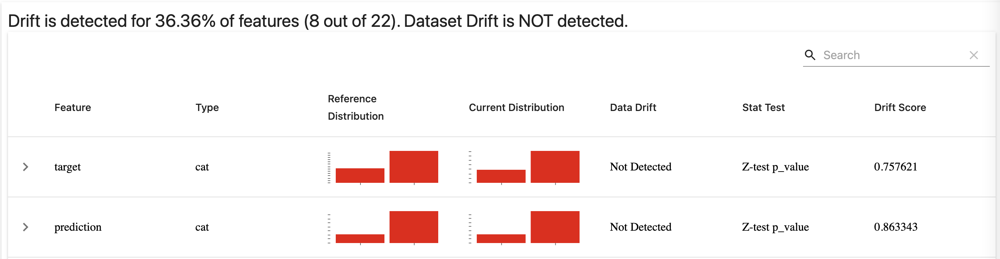

# Model Monitoring

Run the following script in this folder to start up the Grafana, Evidently and Prometheus services in individual Docker containers. The additional `--build` flag makes sure we build the images before starting the resulting containers. 

```bash
docker compose up --build
```

- The app can then be found on the same url as before, `http://127.0.0.1:9696/`
- You can query the Prometheus database via the UI at `http://127.0.0.1:9091/`
- The Grafana monitoring dashboards can be reached at `http://127.0.0.1:3000/`

From this folder, you can also run `python generate_evidently_report.py` to generate a comprehensive Evidently report to detect data drift relative a specified reference dataset. The report is generated every 3 hours using Prefect. The resulting report can be found in the `reports` folder. Use a browser to open it. 



